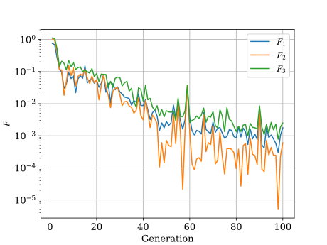
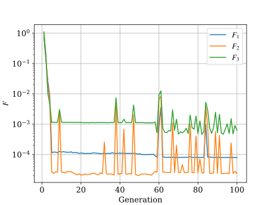
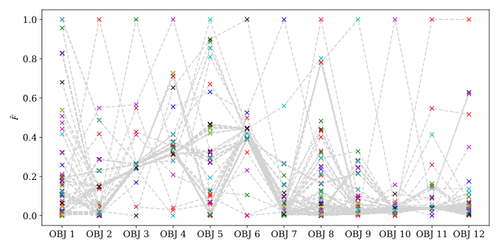
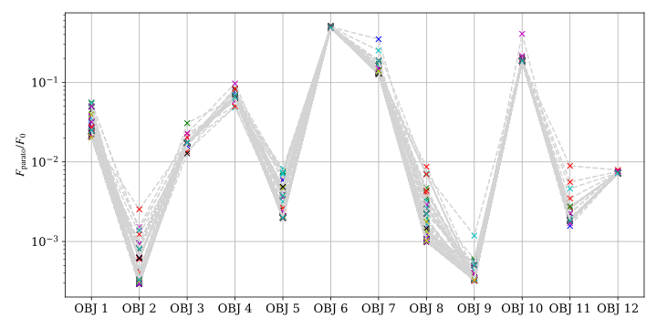

# pyMechOpt: A Python toolbox for optimizing chemical reaction mechanisms

pyMechOpt can optimize the chemical reaction mechanism and reduce the difference with the detailed reaction mechanism.

## Installation

It is recommended to install pyMechOpt in a newly created python environment.

| Package                         | version  |
|---------------------------------|----------|
| [Cantera](https://cantera.org/) | \>=3.00  |
| [Pymoo](https://pymoo.org/)     | \>=0.6.0 |

After installing the above package, you can follow the following command to install pyMechOpt:
    
    git clone
    pip install pyMechOpt

## Models and methods

In pyMechOpt, you can choose to use multi-objective and single-objective methods for optimization.

### Single-objective

$$ 
\begin{align*}
\mathop{\mathrm{minimize}}\limits_{A_k,b_k,E_k\in \mathbb{R}}&
\sqrt{\sum_{m\in\mathbb{M}}{\left(\sum_{i\in I_I}\left( \frac{\int_{\tau_s}^{\tau_e}{\left| x_{i,m}-x_{i,m}^D \right|}}{\int_{\tau_s}^{\tau_e}{\left| x_{i,m}^D \right|}} \right)^2+ \sum_{i\in{I_p}}{\left(\frac{\tau_{p,j,m}-\tau_{p,j,m}^D}{\tau_{p,j,m}^D}\right)^2} \right)^2}} \\

\mathrm{subject\ to}& \left(1-r\right)A_k\leq A_k\leq \left(1+r\right)A_k\\

 &\left(1-r\right)b_k\leq b_k\leq \left(1+r\right)b_k\\

  &\left(1-r\right)E_k\leq E_k\leq \left(1+r\right)E_k\\

\end{align*}
$$

Alternative methods include genetic algorithms, differential evolution, etc. provided by [pymoo](https://pymoo.org/), as well as some algorithms based on line search, such as gradient descent(GD), conjugate gradient(CG), coordinate descent(CD), etc.

### Multi-objective

In multi-objective optimization, each initial condition corresponds to one objective.

$$ 
\begin{align*}
\mathop{\mathrm{minimize}}\limits_{A_k,b_k,E_k\in \mathbb{R}}&
\sum_{i\in I_I}\left( \frac{\int_{\tau_s}^{\tau_e}{\left| x_{i,m}-x_{i,m}^D \right|}}{\int_{\tau_s}^{\tau_e}{\left| x_{i,m}^D \right|}} \right)^2+ \sum_{i\in{I_p}}{\left(\frac{\tau_{p,j,m}-\tau_{p,j,m}^D}{\tau_{p,j,m}^D}\right)^2} \\

\mathrm{subject\ to}& \left(1-r\right)A_k\leq A_k\leq \left(1+r\right)A_k\\

 &\left(1-r\right)b_k\leq b_k\leq \left(1+r\right)b_k\\

  &\left(1-r\right)E_k\leq E_k\leq \left(1+r\right)E_k\\

\end{align*}
$$

For multi-objective optimization models, pyMechOpt calls multi-objective evolutionary algorithms such as NSGA2, NSGA3, and MOEAD in [pymoo](https://pymoo.org/).

NSGA-3

MOEAD

MOEAD: Normalized F in Pareto front

MOEAD: F reduction factor

## Usage

You can import modules by using the following code:

    import numpy as np
    import cantera as ct

    from pyMechOpt.multi_obj import mo_problem      # For multi-objective
    # from pyMechOpt.single_obj import so_problem   # For single-objective
    # from pyMechOpt.line_search import ls_problem  # For line search method

Firstly, provide the mechanism that needs to be optimized and an accurate mechanism:

    mech_detailed = 'mech/gri30.yaml'             # detailed mech
    mech_reduced ='mech/gri30-r45.yaml'           # reduced mech

Given the species to be optimized and the initial conditions:

    spcs_int = ['CH4',
                'O2']                                                     
    spcs_peak = ['CH2O',
                'CO',
                'CO2']

    pres = 1e05 * np.array([1, 1, 1, 1, 1, 1, 100, 100, 100, 100, 100, 100])
    temp_ini = np.array([900, 900, 900, 1000, 1000, 1000, 900, 900, 900, 1000, 1000, 1000])
    ratio_eq = np.array([0.25, 1, 4, 0.25, 1, 4, 0.25, 1, 4, 0.25, 1, 4])

Then you can start optimizing.

    opt_prob = mo_problem(mech_detailed, mech_reduced, temperature, ratio, pressure, spcs_int, spcs_peak)
    opt_prob.calc_skip(skip_num=50)   # Optional: If you need to reduce the number of optimized variables through sensitivity analysis.
    opt_prob.load_skip()    # Optional: Read the variables that need to be skipped from the file.
    opt_prob.run(algorithm="MOEAD", max_gen=10, pop_size=200)

